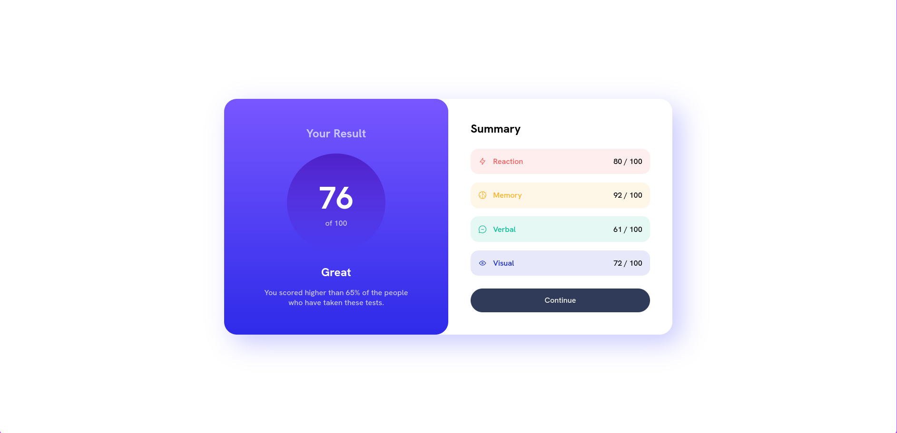

# Frontend Mentor - Results summary component solution

This is a solution to the [Results summary component challenge on Frontend Mentor](https://www.frontendmentor.io/challenges/results-summary-component-CE_K6s0maV). Frontend Mentor challenges help you improve your coding skills by building realistic projects. 

## Table of contents

- [Overview](#overview)
  - [The challenge](#the-challenge)
  - [Screenshot](#screenshot)
  - [Links](#links)
- [My process](#my-process)
  - [Built with](#built-with)
  - [What I learned](#what-i-learned)
  - [Useful resources](#useful-resources)

**Note: Delete this note and update the table of contents based on what sections you keep.**

## Overview

### The challenge

Your challenge is to build out this results summary component and get it looking as close to the design as possible.

A `data.json` file is provided. So you can use that to add the results and total score dynamically if you choose.

Users should be able to:

- View the optimal layout for the interface depending on their device's screen size
- See hover and focus states for all interactive elements on the page

### Screenshot



### Links

- Solution URL: [Add solution URL here](https://your-solution-url.com)
- Live Site URL: [Add live site URL here](https://your-live-site-url.com)

## My process
- First, I make structure all the site with HTML markups, then I add the style and I try to size all the component as responsive as possible.
- When i am obligated to set media queries I use it but I try to use it less as possible.

### Built with

- Semantic HTML5 markup
- CSS custom properties
- CSS Flex
- SASS Syntax
- A bit of JavaScript

### What I learned

- In this challenge, I learn how to handle `.json` files to modify dynamically some values on the site. Thus, I use a bit of JavaScript to calculate, for example, the average of all the grades. 

- With the [Sass Syntax](https://sass-lang.com/) i was able to set [placholders](https://sass-lang.com/documentation/style-rules/placeholder-selectors) selectors to make my code cleaner.

To see how you can add code snippets, see below:

```scss
%flex-center-column {
    display: flex;
    align-items: center;
    justify-content: center;
    flex-direction: column;
}
```
```js
function avg(arr) {
    let s = 0;
    let i = 0;

    arr.forEach(n => {
        s += n;
        i++;
    });

    return Math.floor(s / i);
}
```

If you want more help with writing markdown, we'd recommend checking out [The Markdown Guide](https://www.markdownguide.org/) to learn more.

### Useful resources

- [Sass Syntax](https://sass-lang.com/documentation/syntax) - This is helpful for perform in Sass.
- [To Handle JSON files](https://www.w3schools.com/js/js_json_http.asp) - This help me to handle the `data.json` file.

